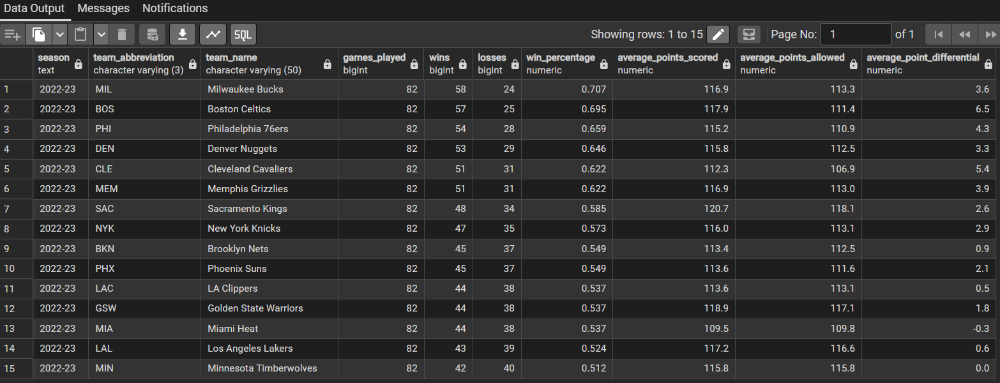
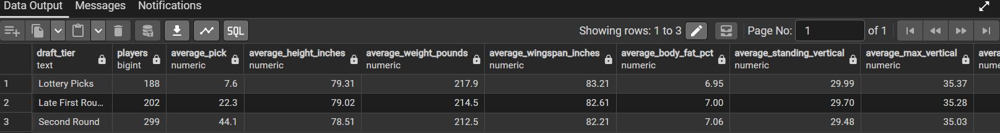
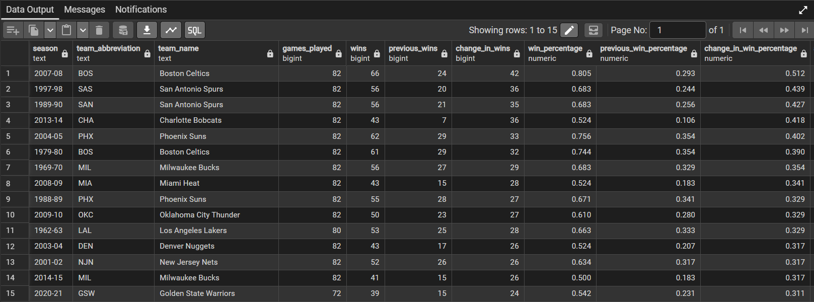
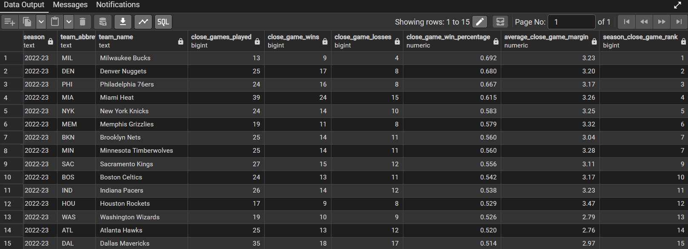

# NBA Player and Team Performance Analysis

## Project Overview

This project uses PostgreSQL to build and analyze a relational database containing NBA game, team, player, draft, and combine data.

The database contains more than 137,000 records across five primary tables. SQL queries were used to clean historical data, create analysis-ready views, compare team performance, examine year-over-year improvement, evaluate close-game results, and study differences in combine measurements across draft ranges.

## Tools and Skills

- PostgreSQL
- pgAdmin 4
- Relational database design
- Data import and validation
- Data cleaning
- Joins
- Common table expressions
- Aggregate functions
- Window functions
- `CASE` statements
- Ranking
- Year-over-year analysis
- Query documentation

## Database Tables

| Table | Records | Description |
|---|---:|---|
| `games` | 65,698 | Home and away team statistics for NBA games |
| `line_scores` | 58,053 | Quarter-by-quarter and overtime scoring |
| `common_player_info` | 4,171 | Player biographical, roster, and draft information |
| `draft_history` | 7,990 | NBA draft selections by season, round, and team |
| `draft_combine_stats` | 1,202 | Prospect measurements and athletic testing results |

## Database Preparation

The raw CSV files were imported into a dedicated PostgreSQL schema named `nba`.

The setup process included:

- Creating tables with data types matching the source files
- Validating imported row counts
- Adding primary keys and indexes
- Checking duplicate game IDs
- Reviewing missing historical statistics
- Standardizing inconsistent season-type labels
- Creating cleaned views while preserving the original tables

The analysis-ready views include:

- `nba.v_games_clean`
- `nba.v_line_scores_clean`
- `nba.v_game_results`

## Analysis 1: Regular-Season Team Performance

The first analysis converts each game into separate home-team and away-team records before calculating:

- Games played
- Wins and losses
- Win percentage
- Average points scored
- Average points allowed
- Average point differential

For the 2022–23 season, Milwaukee finished with the highest win percentage in the dataset results at 58–24, followed by Boston at 57–25. Boston recorded the strongest point differential among the displayed teams at 6.5 points per game.

[View the SQL query](sql/06_team_analysis.sql)



## Analysis 2: Draft and Combine Measurements

Draft-history records were joined with combine data using player ID and draft season. Prospects were then grouped into:

- Lottery picks
- Late first-round picks
- Second-round picks

The results show that lottery picks in the matched sample were slightly taller, heavier, and longer on average than players selected in the second round.

| Draft Tier | Players | Average Height | Average Weight | Average Wingspan |
|---|---:|---:|---:|---:|
| Lottery Picks | 188 | 79.31 in | 217.9 lb | 83.21 in |
| Late First Round | 202 | 79.02 in | 214.5 lb | 82.61 in |
| Second Round | 299 | 78.51 in | 212.5 lb | 82.21 in |

These results describe differences in the available combine sample and do not establish that physical measurements caused players to be drafted earlier.

[View the SQL query](sql/07_draft_analysis.sql)



## Analysis 3: Year-Over-Year Team Improvement

The team-improvement analysis uses the `LAG()` window function to compare each team with its previous qualifying season.

The query measures changes in:

- Total wins
- Win percentage
- Average point differential

The largest improvement in the results was the 2007–08 Boston Celtics. Boston increased from 24 wins to 66 wins, an improvement of 42 games and 0.512 in win percentage.

[View the SQL query](sql/08_team_improvement_analysis.sql)



## Analysis 4: Close-Game Performance

A close game was defined as a regular-season game decided by five points or fewer.

Teams with at least ten qualifying games were ranked within each season using the `RANK()` window function.

In 2022–23:

- Milwaukee ranked first at 9–4 with a .692 close-game win percentage.
- Denver ranked second at 17–8 with a .680 win percentage.
- Philadelphia ranked third at 16–8 with a .667 win percentage.

Close-game performance should be interpreted carefully because teams played different numbers of qualifying games.

[View the SQL query](sql/09_close_game_analysis.sql)



## Repository Structure

```text
nba-sql-analysis/
├── data/
│   └── README.md
├── documentation/
│   ├── DATA_INVENTORY.md
│   ├── PGADMIN_IMPORT_GUIDE.md
│   └── README.md
├── images/
│   ├── team_performance_results.png
│   ├── draft_analysis_results.png
│   ├── team_improvement_results.png
│   └── close_game_results.png
├── sql/
│   ├── 01_create_database.sql
│   ├── 02_create_raw_tables.sql
│   ├── 03_post_import_setup.sql
│   ├── 04_quality_checks.sql
│   ├── 05_cleaning_views.sql
│   ├── 06_team_analysis.sql
│   ├── 07_draft_analysis.sql
│   ├── 08_team_improvement_analysis.sql
│   └── 09_close_game_analysis.sql
└── README.md
